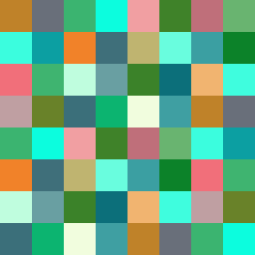
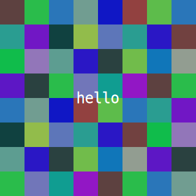

# imgg - cover images generator

## Description
I needed a simple tool to generate dummy images for my blog's header and metadata, so I wrote one. **imgg** simply glues SVG `<rect>` blocks with different colors based on md5sum of an input text.

## Usage & example
Running `./imgg` without arguments produces a 320x320 svg image using the value of `$RANDOM` as the input text. The output is printed to the standard output.

To specify an output file use the option `-o FILE` or `--output-file FILE`. For example; running `./imgg -o examples/random.svg` produces the following image:



To add a label to the image use the option `-l "label"`, for example `./imgg -l "hello" -o examples/hello.svg` produces:



Other available options are
```
Options:
  -h, --help                        display this help text and exit
  -v, --version                     print version and exit
  -s, --image-size WIDTH[,HEIGHT]   define ouput image width and height
  -p, --pixel-size WIDTH[,HEIGHT]   define squares width and height
  -f, --font-size SIZE              define label font size
  -i, --input-text TEXT             generate image based on TEXT hash
  -l, --label TEXT                  write TEXT on image
  -o, --output-file FILE            output to FILE instead of stdout

Defaults:
  Image width:  320
  Image height: equal to image width
  Pixel width:  40
  Pixel height: equal to image width
  Font size:    24 (in px)
  Label:        none
  Text:         same as label, or random if not defined
```

## TODO
- [x] Generate images based on imput text
- [ ] Detect and correct sizes errors
- [ ] Detect and correct lable line length
- [ ] Add multiline option
- [ ] Write more test inputs to detect edge cases
- [ ] Write proper documentation

## Credits
- [CHANGELOG](./CHANGELOG.md) format is based on [Keep a Changelog](https://keepachangelog.com/en/1.0.0/)
- This project adheres to [Semantic Versioning](https://semver.org/spec/v2.0.0.html)
- And I try my best to follow [Conventional Commits](https://www.conventionalcommits.org/en/v1.0.0/)
- [.gitignore](./.gitignore) was generated using [gitignore.io](https://www.toptal.com/developers/gitignore)

## License
This project is licensed under [The Unlicense](./LICENSE)
